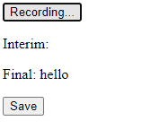
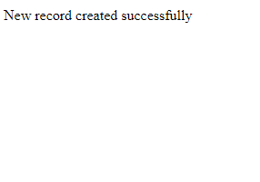

# Speech-to-Text Web page

## Overview

This web application uses the Web Speech API to convert spoken words into text. It records audio from the user's microphone, processes the speech into a transcript, and allows the user to save the transcript to a MySQL database.

## Files

- `index.html`: Main HTML file with the user interface.
- `script.js`: JavaScript file for handling speech recognition and UI interactions.
- `save_speech.php`: PHP script for saving the transcript to the database.

## Prerequisites

1. A web server with PHP support (e.g., XAMPP, WAMP).

## usage 
### Start Recording:
1.Click the "Start Recording" button to begin capturing your speech.
2.The transcript will be displayed in real-time, showing both interim and final results.

### Save Transcript:
1.Once you're done recording, click the "Save" button to store the final transcript in the database.

## Browser Compatibility
This application uses the Web Speech API, which is currently supported in Google Chrome

"If you see the message "Web Speech API not supported in this browser," try using Google Chrome."

## contributing
Contributions are welcome! Please submit issues or pull requests if you have suggestions or improvements for this project

